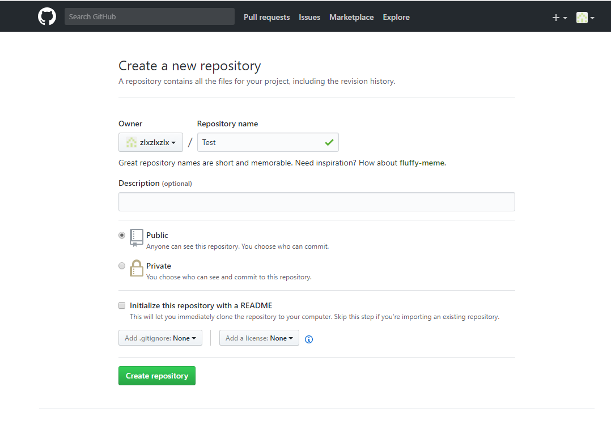
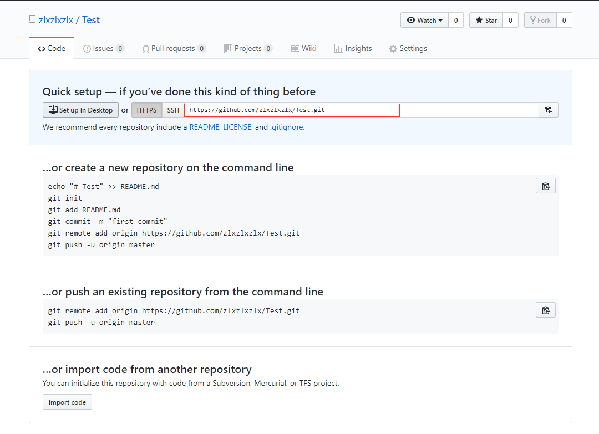
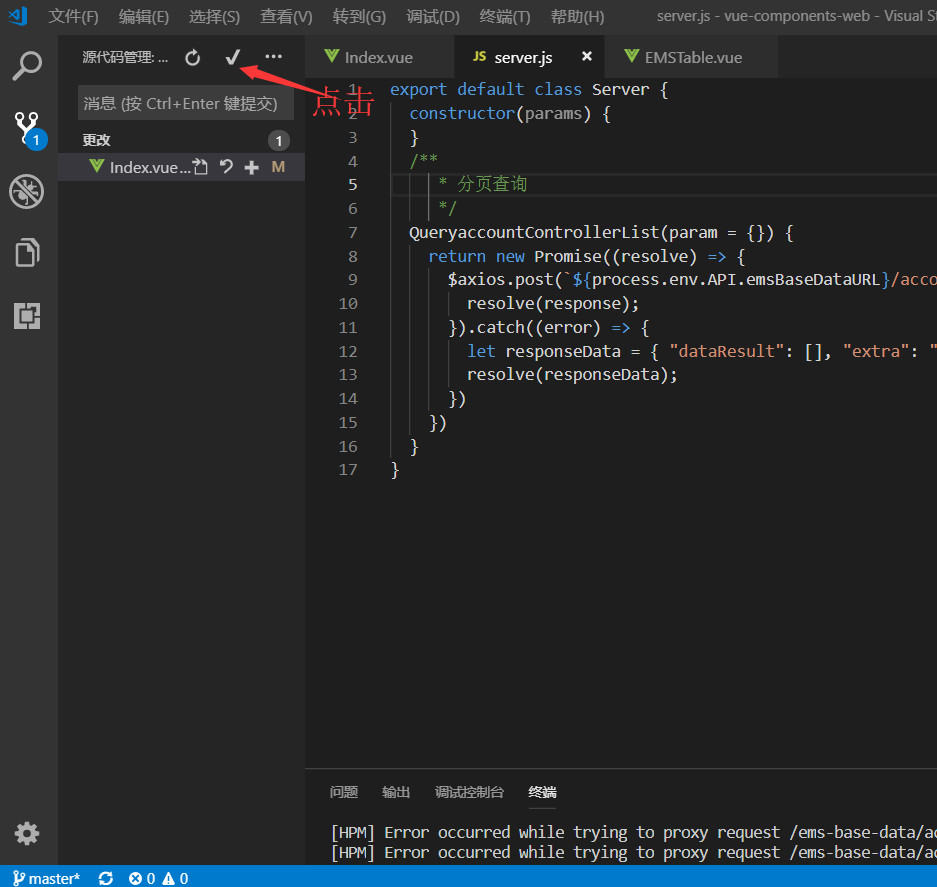
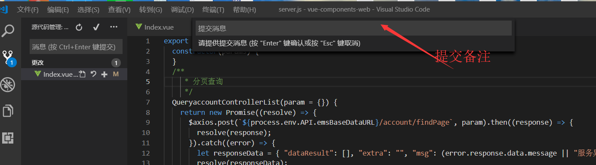
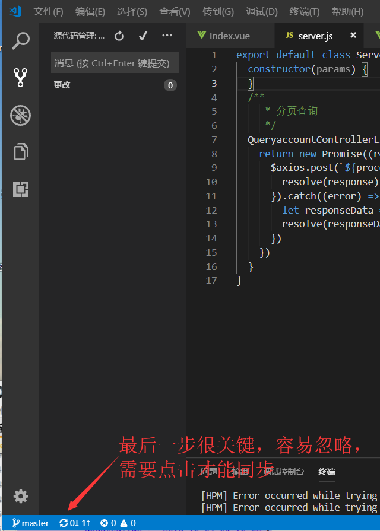

# 上传及更新代码到github（以及如何在vscode上提交自己的代码）
项目地址 (https://github.com/33sandy/node-vue-moba.git)
## 上传本地代码
第一步：去github上创建自己的Repository，创建页面如下图所示：

## 红框为新建的仓库的https地址

## 第二步：
echo "# Test" >> README.md
## 第三步：建立git仓库
git init
## 第四步：将项目的所有文件添加到仓库中 
git add .
## 第五步：
git add README.md
## 第六步：提交到仓库
git commit -m "注释语句"
## 第七步：将本地的仓库关联到GitHub，后面的https改成刚刚自己的地址，上面的红框处
git remote add origin https://github.com/33sandy/node-vue-moba.git
## 第八步：上传github之前pull一下
git pull origin master
## 出现错误的主要原因是github中的README.md文件不在本地代码目录中时

可以通过如下命令进行代码合并【注：pull=fetch+merge]

git pull --rebase origin master

## 第九步：上传代码到GitHub远程仓库
git push -u origin master
## 中间可能会让你输入Username和Password，你只要输入github的账号和密码就行了。执行完后，如果没有异常，等待执行完就上传成功了。
# 更新代码
## 第一步：查看当前的git仓库状态，可以使用git status
git status
## 第二步：更新全部
git add *
## 第三步：接着输入git commit -m "更新说明"
git commit -m "更新说明"
## 第四步：先git pull,拉取当前分支最新代码
git pull
## 第五步：push到远程master分支上
git push origin master
## 不出意外，打开GitHub已经同步了
## Git 全局设置:可以免密上传
## git config --global user.name "33sandy" 
## git config --global user.email "670594384@qq.com"
//-------------------------------------------------------------------------------

如何在vscode上提交代码到github

1:

 2：

 

3：

 